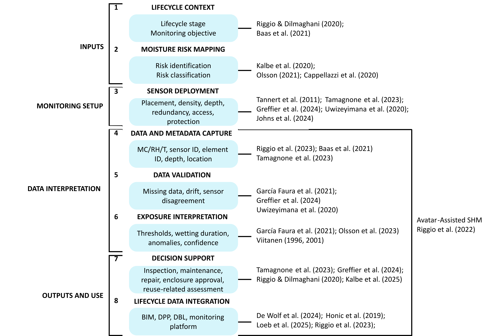

# Extended Evidence Base for the Conceptual Framework

This folder documents the extended literature evidence used in developing the conceptual framework presented in the accompanying conference paper, *A Conceptual Framework for Reuse-Driven Moisture Sensing and Data Acquisition in Mass-Timber Buildings*.

It preserves traceability between the literature synthesis and the framework layers. It supplements the conference paper; it does not replace references needed to substantiate claims made directly in the paper.

## Framework development

The framework was developed through a targeted literature synthesis combining database searching, snowballing, and review of timber-moisture and monitoring studies. A total of 54 articles were assessed, of which 20 were retained because they provided extractable evidence concerning sensor location, deployment configuration, contextual data requirements, monitoring and data-quality issues, moisture-exposure interpretation, maintenance or reuse-related decision support, or lifecycle use of monitoring records.

The retained studies were coded in NVivo using inductively developed codes covering lifecycle stage, monitoring purpose, building and member type, sensor location, risk drivers, sensor configuration and density, installation guidance, monitoring issues, risk prediction, contextual information, and recommended monitoring systems.

Framework development then proceeded through iterative synthesis of the coded material. Evidence reported directly in individual studies was distinguished from synthesis judgements developed through comparison across sources. The resulting concepts were organised into eight linked framework layers.

## Conceptual framework and supporting literature

*Conceptual framework for reuse-informed moisture sensing and data acquisition in mass-timber buildings, showing literature used to support development of the individual layers.*

The publications associated with each layer are supporting evidence, rather than direct sources of the complete layer. The eight-layer structure and the relationships between layers represent the authors' synthesis of evidence distributed across the reviewed literature.

## Framework-to-evidence map

| Layer | Framework function | Supporting literature | Contribution to framework development |
|---|---|---|---|
| 1. Lifecycle context | Establishes lifecycle stage and monitoring objective before monitoring requirements are defined. | Riggio & Dilmaghani (2020); Baas et al. (2021) | Positions monitoring within lifecycle and structural-health-monitoring contexts and supports defining objectives before deployment. |
| 2. Moisture risk mapping | Identifies moisture-prone locations and classifies their relative monitoring priority. | Kalbe et al. (2020); Olsson (2021); Cappellazzi et al. (2020) | Provides evidence on moisture-sensitive details, construction exposure, water ingress, drying limitations, and deterioration mechanisms. |
| 3. Sensor deployment | Translates identified risks into placement, density, depth, redundancy, access, and protection decisions. | Tannert et al. (2011); Tamagnone et al. (2023); Greffier et al. (2024); Uwizeyimana et al. (2020); Johns et al. (2024) | Informs sensor location, depth, coverage, redundancy, accessibility, protection, and practical monitoring constraints. |
| 4. Data and metadata capture | Defines measured values and context needed to preserve the meaning of monitoring records. | Riggio et al. (2023); Baas et al. (2021); Tamagnone et al. (2023) | Links MC, RH, and temperature to sensor and element identities, depth, location, and later interpretation context. |
| 5. Data validation | Evaluates whether monitoring records are reliable enough for interpretation. | García Faura et al. (2021); Greffier et al. (2024); Uwizeyimana et al. (2020) | Addresses missing data, anomalies, sensor disagreement, installation effects, drift, and other quality issues. |
| 6. Exposure interpretation | Converts validated observations into indicators of moisture exposure and drying behaviour. | García Faura et al. (2021); Olsson et al. (2023); Viitanen (1996, 2001) | Supports thresholds, exposure duration, wetting and drying behaviour, anomalies, biological risk, and uncertainty. |
| 7. Decision support | Connects interpreted information to inspection, maintenance, repair, enclosure approval, and reuse assessment. | Tamagnone et al. (2023); Greffier et al. (2024); Riggio & Dilmaghani (2020); Kalbe et al. (2025) | Supports identifying adverse conditions, targeting intervention, and supplying evidence for lifecycle decisions. |
| 8. Lifecycle data integration | Preserves monitoring information in digital systems across lifecycle stages. | De Wolf et al. (2024); Honic et al. (2019); Loeb et al. (2025); Riggio et al. (2023) | Supports structured information management through BIM, product passports, building logbooks, and monitoring platforms. |

## Cross-layer concept: Avatar-Assisted Structural Health Monitoring

Supporting literature: Riggio et al. (2022).

Avatar-Assisted Structural Health Monitoring connects sensor observations with contextual information and a persistent digital representation of a physical timber element. It is relevant across data and metadata capture, data validation, exposure interpretation, decision support, and lifecycle data integration. It therefore provides precedent for treating monitoring data as part of a broader information process rather than as isolated measurements.

## References

Baas, E. J., Riggio, M., & Barbosa, A. R. (2021). A methodological approach for structural health monitoring of mass-timber buildings under construction. *Construction and Building Materials, 268*, 121153. https://doi.org/10.1016/j.conbuildmat.2020.121153

Cappellazzi, J., Konkler, M. J., Sinha, A., & Morrell, J. J. (2020). Potential for decay in mass timber elements: A review of the risks and identifying possible solutions. *Wood Material Science & Engineering, 15*(1), 1–10. https://doi.org/10.1080/17480272.2020.1720804

De Wolf, C., Byers, B. S., Raghu, D., Rodeyns, J., Selman, A. D., Çetin, S., Ramanathan, S., Norouzi, S., Kim, J. Y., & Ochsendorf, J. (2024). D5 digital circular workflow: Five digital steps towards matchmaking for material reuse in construction. *Journal of Industrial Ecology, 28*(6), 1397–1412. https://doi.org/10.1111/jiec.13575

García Faura, Á., Štepec, D., Cankar, M., & Humar, M. (2021). Application of unsupervised anomaly detection techniques to moisture content data from wood constructions. *Forests, 12*(2), 194. https://doi.org/10.3390/f12020194

Greffier, G., Espinosa, L., Perrin, M., & Eyma, F. (2024). Structural health monitoring of glulam structures: Analysis of durability and damage mechanisms. *European Journal of Wood and Wood Products, 82*, 2047–2063. https://doi.org/10.1007/s00107-024-02140-9

Honic, M., Kovacic, I., & Rechberger, H. (2019). Concept for a BIM-based material passport for buildings. *IOP Conference Series: Earth and Environmental Science, 225*, 012073. https://doi.org/10.1088/1755-1315/225/1/012073

Johns, D., Vyas, Y., & Richman, R. (2024). State-of-the-art review of moisture content sensor deployment in mass timber construction. *Journal of Architectural Engineering, 30*(2), 03124001. https://doi.org/10.1061/JAEIED.AEENG-1638

Kalbe, K. (2025). *Moisture safety of cross-laminated timber construction* (Doctoral thesis). TalTech Press. https://doi.org/10.23658/taltech.44/2025

Kalbe, K., Kukk, V., & Kalamees, T. (2020). Identification and improvement of critical joints in CLT construction without weather protection. *E3S Web of Conferences, 172*, 10002. https://doi.org/10.1051/e3sconf/202017210002

Loeb, L., Ibach, A.-K., Kelm, A., Deich, J., Pomp, A., & Meins-Becker, A. (2025). Recommendations for a digital building product passport using CLT elements as a case study. *Proceedings of International Structural Engineering and Construction, 12*(1).

Olsson, L. (2021). CLT construction without weather protection requires extensive moisture control. *Journal of Building Physics, 45*(1), 5–35. https://doi.org/10.1177/1744259121996388

Olsson, L., Lång, L., Bok, G., & Mjörnell, K. (2023). Development of laboratory experiments to determine critical moisture condition of CLT constructions. *Journal of Physics: Conference Series, 2654*, 012022. https://doi.org/10.1088/1742-6596/2654/1/012022

Riggio, M., & Dilmaghani, M. (2020). Structural health monitoring of timber buildings: A literature survey. *Building Research & Information, 48*(8), 817–837. https://doi.org/10.1080/09613218.2019.1681253

Riggio, M., Dilmaghani, M., & Sanchez, C. A. (2023). Understanding structural health monitoring data to support decision-making processes and service life management of mass timber buildings: A preliminary study on use of data scaffolding. *International Wood Products Journal, 14*(1), 22–34. https://doi.org/10.1080/20426445.2023.2177092

Riggio, M., Mrissa, M., Krész, M., Včelák, J., Sandak, J., & Sandak, A. (2022). Leveraging structural health monitoring data through avatars to extend the service life of mass timber buildings. *Frontiers in Built Environment, 8*, 887593. https://doi.org/10.3389/fbuil.2022.887593

Tamagnone, G., Hairstans, R., Martin, J., & Edmondson, V. (2023). Method for monitoring the moisture response of a cross laminated timber (CLT) panel building. In *Proceedings of the 2nd International Conference on Moisture in Buildings* (Article 33). https://doi.org/10.14293/icmb230019

Tannert, T., Berger, R., Vogel, M., & Müller, A. (2011). Remote moisture monitoring of timber bridges: A case study. In *Proceedings of the 5th International Conference on Structural Health Monitoring of Intelligent Infrastructure (SHMII-5)*, Cancún, Mexico.

Uwizeyimana, P., Perrin, M., & Eyma, F. (2020). Moisture monitoring in glulam timber structures with embedded resistive sensors: Study of influence parameters. *Wood Science and Technology, 54*(6), 1463–1478. https://doi.org/10.1007/s00226-020-01228-8

Viitanen, H. (1996). *Factors affecting the development of mould and brown rot decay in wooden material and wooden structures: Effect of humidity, temperature and exposure time* (Doctoral dissertation). Swedish University of Agricultural Sciences.

Viitanen, H. (2001). Factors affecting mould growth on kiln-dried wood. In *Proceedings of the 3rd European COST E15 Workshop on Wood Drying* (pp. 4:1–4:8). VTT Technical Research Centre of Finland.

This evidence base accompanies version 1.0.0 of the Timber Moisture Monitoring Framework.
