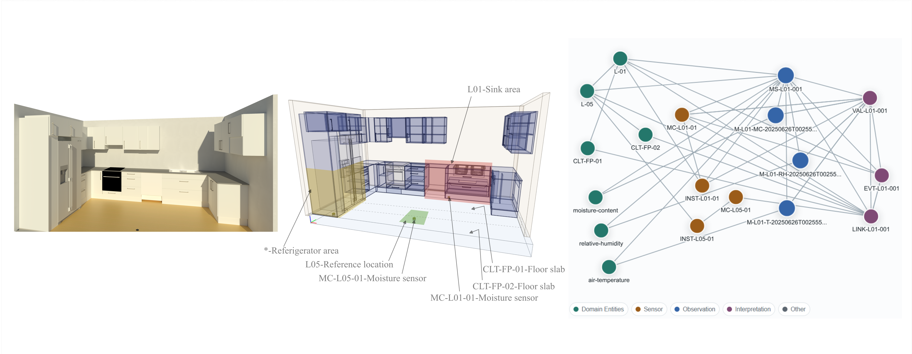

# timber-moisture-framework

This repository accompanies the paper **“A Conceptual Framework for Reuse-Driven Moisture Sensing and Data Acquisition in Mass-Timber Buildings”**. It provides a worked CLT kitchen-floor application and templates for applying the framework to risk-location classification, sensor deployment, and monitoring-record schema development.

*Framework implementation example for reuse-driven moisture monitoring in mass-timber buildings.*

## Repository contents

- `01_worked_example/`  
  Illustrative CLT kitchen-floor application of the framework.

- `02_risk_location_classification/`  
  Template for identifying and classifying moisture-risk locations.

- `03_sensor_deployment/`  
  Template for translating risk classification into sensor placement, density, depth, redundancy, and protection decisions.

- `04_monitoring_record_schema/`
  Template and data-specification artifacts for structuring monitoring records, including a SOSA/QUDT-aligned JSON-LD context, example JSON-LD graph, JSON Schema validation files, knowledge-graph visualizer, and minimal logger-export mapping example.

## Knowledge graph visualizer
The monitoring-record example can be explored through the live knowledge graph visualizer:
https://sosabaa.github.io/timber-moisture-framework/04_monitoring_record_schema/knowledge_graph_visualizer.html

## Intended use

The repository is intended as a practical companion to the framework. The worked example is illustrative and does not prescribe universal sensor spacing, fixed thresholds, or standardised layouts. Users should adapt the templates to project-specific moisture risks, monitoring objectives, and decision contexts.

## Citation

Please cite the accompanying conference paper and this repository when using or adapting the materials.
